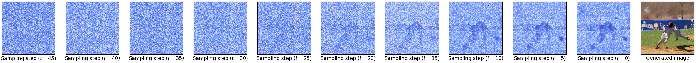
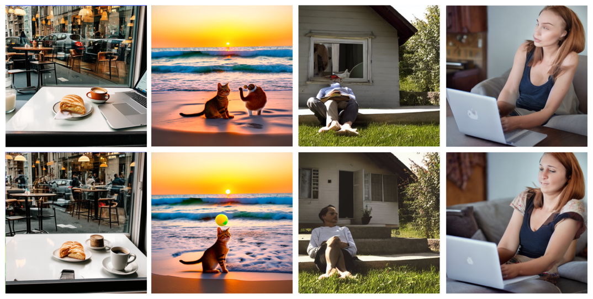
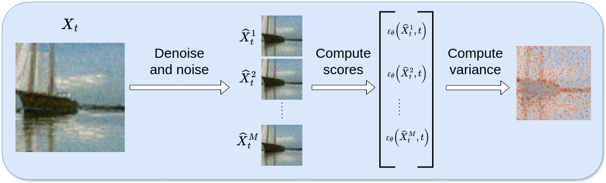

# Diffusion Model Guided Sampling with Pixel-Wise Aleatoric Uncertainty Estimation

This repository contains the official implementation of our paper "Diffusion Model Guided Sampling with Pixel-Wise Aleatoric Uncertainty Estimation". Our work introduces a novel approach to estimate pixel-wise uncertainty in diffusion models, enabling more reliable and controlled image generation.

The method provides:
- Pixel-wise uncertainty maps for generated images
- Improved sampling guidance based on uncertainty estimates
- Evaluation metrics for uncertainty quality assessment
- Implementation for various datasets including ImageNet and CIFAR-10

For implementation details and usage instructions, please refer to the individual scripts described below.

## Installing environment

To install the environment, use `hatch`:

```bash
# Install hatch if not already installed
pip install hatch

# Create and activate default environment
hatch shell

# Alternatively, for CPU-only installation
hatch -e cpu shell
```

## Download models:

```bash
# Download U-ViT models
hatch run download-uvit-imagenet64-M
hatch run download-uvit-256
hatch run download-uvit-512

# Download ADM models
hatch run download-adm-imagenet128
hatch run download-adm-imagenet64

# Download other models
hatch run download-uvit-autoencoder
hatch run download-ilora-sd-depth
hatch run download-imagenet64-classifier
hatch run download-imagenet128-classifier
```

## Dataset download for FID calculation

### ImageNet Dataset Download

To download the ImageNet dataset for FID calculation, use the provided script:

```bash
# Run the download script
bash scripts/download_imagenet.sh
```

**Note**: You need to obtain valid ImageNet download links and add them to the script at _scripts/download_imagenet.sh_ before running. The links are available from the official ImageNet website after registration.


## Scripts

This directory contains the following Python scripts:

- **clean_empty_runs.py**: Removes empty run directories to clean up storage.
- **compute_ause.py**: Calculates the Area Under the Sparsification Error (AUSE) for uncertainty estimation.
- **compute_dataset_fid_imagenet64_npz.py**: Computes the Fréchet Inception Distance (FID) for ImageNet64 datasets in NPZ format.
- **compute_dataset_fid_old.py**: An earlier version of the FID computation script.
- **compute_dataset_fid.py**: Computes the FID for generated datasets.
- **compute_fid_imagenet128.py**: Calculates the FID for the ImageNet128 dataset.
- **compute_fid_imagenet.py**: Computes the FID for the ImageNet dataset.
- **compute_nll.py**: Calculates the Negative Log-Likelihood (NLL) for model evaluation.
- **compute_pr_generated_samples.py**: Computes Precision and Recall metrics for generated samples.
- **compute_pr_true_dataset.py**: Computes Precision and Recall for the true dataset.
- **compute_statistics_fid_score.py**: Gathers statistics related to FID scores.
- **compute_threshold_pixel_wise.py**: Determines pixel-wise thresholds for uncertainty estimation.
- **eval_fid_lsun_churches256.py**: Evaluates FID on the LSUN Churches256 dataset.
- **generate_compute_fid_score_guided_diffusion_imagenet128.py**: Generates images using guided diffusion and computes FID scores on ImageNet128.
- **generate_dataset_score_uncertainty_cifar10.py**: Generates datasets and computes uncertainty scores on CIFAR-10.
- **generate_dataset_score_uncertainty_imagenet_classifier_guidance.py**: Generates datasets with classifier guidance and computes uncertainty scores on ImageNet.
- **generate_dataset_score_uncertainty_imagenet.py**: Generates datasets and computes uncertainty scores on ImageNet.
- **generate_diffusion_starting_data.py**: Generates initial data for diffusion models.
- **generate_images_with_uncertainty_threshold.py**: Generates images using specified uncertainty thresholds.
- **generate_with_uncertainty_threshold_flux.py**: Generates images with uncertainty thresholds using flux methods.
- **generate_with_uncertainty_threshold_stable_diffusion_3.py**: Uses stable diffusion models to generate images with uncertainty guidance.
- **generate_with_uncertainty_threshold_stable_diffusion.py**: Generates images using stable diffusion and uncertainty guidance.
- **measure_times_cifar10.py**: Measures processing times on the CIFAR-10 dataset.
- **measure_times_imagenet.py**: Measures processing times on the ImageNet dataset.
- **plot_curve_M.py**: Plots evaluation curves for analysis.
- **summary_experiments.py**: Summarizes results from various experiments.
- **uncertainty_benchmark_imagenet.py**: Benchmarks uncertainty estimation methods on ImageNet.